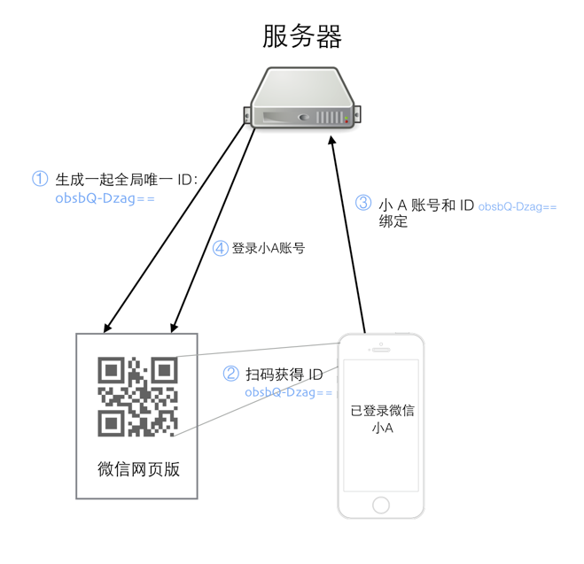

[TOC]
##扫码登录原理
如果你用我查查、支付宝、新浪微博等软件扫码二维码，你会发现此二维码解析出来是如下的网址：https://login.weixin.qq.com/l/obsbQ-Dzag==

接下来详细介绍一下扫码登录具体的每个步骤：

①：用户 A 访问微信网页版，微信服务器为这个会话生成一个全局唯一的 ID，上面的 URL 中 obsbQ-Dzag== 就是这个 ID，此时系统并不知道访问者是谁。

②：用户A打开自己的手机微信并扫描这个二维码，并提示用户是否确认登录。

③：手机上的微信是登录状态，用户点击确认登录后，手机上的微信客户端将微信账号和这个扫描得到的 ID 一起提交到服务器

④：服务器将这个 ID 和用户 A 的微信号绑定在一起，并通知网页版微信，这个 ID 对应的微信号为用户 A，网页版微信加载用户 A 的微信信息，至此，扫码登录全部流程完成

扫码登录看起来神奇，主要是因为微信 APP 扫自家的码会做一些普通二维码软件不会做的额外的操作，那就是将当前已登录的微信和扫出来的 ID 提交到微信服务器，类似的应用还有扫码支付、扫码加公众号等功能，关于二维码在产品设计中的应用，推荐另一篇文章：[《二维码这把利刃，产品应该用到极致》](http://www.jianshu.com/p/60f33497c8c7)。
##实现客户端扫码登录
实现客户端扫码登录分为下列四步：
1.  Web页面生成二维码
生成的二维码中必须要包含一个用于唯一标识用户的数据，这个唯一标识是为了确保将客户端（手机）与web网页绑定，避免其他人登录了你的账号。在这里可以生成以个随机的guid作为唯一标识。
生成二维码，大家可以使用jQuery qrcode插件 (http://www.ideawu.net/blog/archives/795.html)。
2.  客户端扫描二维码
客户端在扫描二维码之前需要验证是否已经登录了账号，如果没有登录，则需要提示用户先登录。如果已经登录了，那么在扫描了二维码后应读取唯一标识guid并将sessionID一并发送给后台服务器（例如Java）。
3.  通过GoEasy服务器主动告知web网页登录成功
后台服务器接收到请求后通过GoEasy将sessionID主动推送给拥有相同唯一标识的web网页。
GoEasy后台实时推送到web :http://www.cnblogs.com/jishaochengduo/articles/5552645.html
Java实现二维码扫码登录:http://goeasy.io/www/demo/qrcodelogin
4.  Web浏览器设置登录的相关cookie信息
Web浏览器收到消息中包括了登录相关的sessionID，浏览器通过javascript代码就可以把cookie加入到浏览器中，这是浏览器就完成了登录。